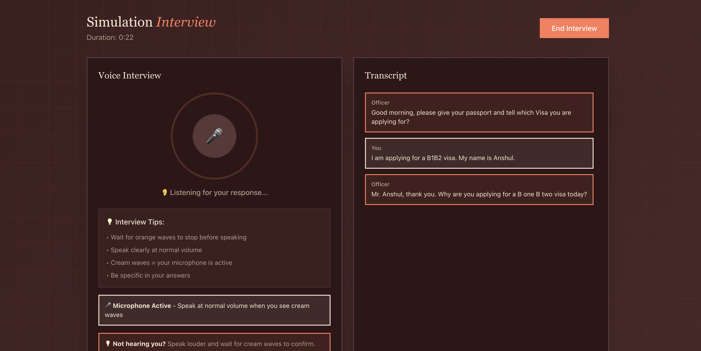
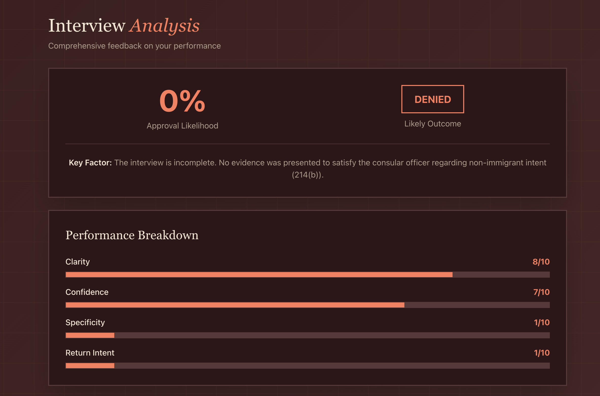

# Prepared - US Visa Interview AI Practice

Practice your US visa interview with an AI-powered voice interviewer before the real thing.

## Why This Exists

In 2024, over 11.5 million people applied for US visas. Over 3 million got denied - that's a 27% rejection rate. Rejected applicants wasted over $500 million in non-refundable visa fees alone.

The number one reason for denial? Section 214(b) - failure to demonstrate intent to return home.

Here's the problem: qualified applicants with perfect paperwork get denied because they don't know how to present their case in a 3-minute voice interview. There's tons of misinformation out there, and people end up memorizing scripts that sound rehearsed.

**Prepared** gives you realistic voice practice with an AI consular officer so you can walk into your real interview confident and prepared.

---

## Try It Live

**🌐 [prepared-99099.web.app](https://prepared-99099.web.app)**

---

## How to Use

1. **Sign up** with email or Google
2. **Complete onboarding** - tell us your visa type, country, field of study/work
3. **Start an interview** - talk naturally with the AI officer (voice only, no typing)
4. **Get instant feedback** - see your approval likelihood, red flags, and specific recommendations

---

## What It Does

- **Realistic voice interviews** with an AI consular officer
- Opens with "Good morning, please give your passport" just like real interviews
- Asks 3-8 questions based on your answers (2-4 minutes total)
- Evaluates return intent, funding sources, and study/work plans
- Gives immediate decisions: approved or denied with exact phrasing real officers use
- Provides comprehensive analysis with approval likelihood, performance scores, and actionable feedback

---

## Built With

- **ElevenLabs Conversational AI** - Voice synthesis and speech-to-text
- **Google Gemini 1.5 Flash** - AI interviewer responses
- **Google Cloud Run** - Backend hosting
- **Firebase** - Authentication and hosting
- **Firestore** - Database
- **React + TailwindCSS** - Frontend

---

## License

MIT
